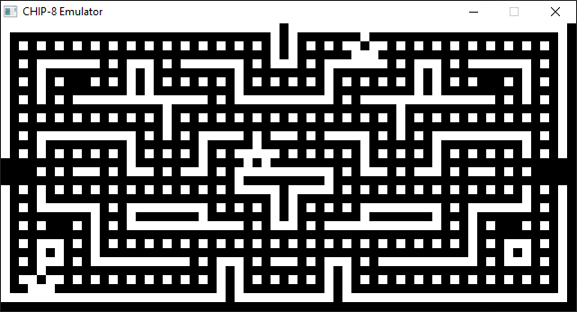

# CHIP-8 Emulator
A basic CHIP-8 emulator written in C with SDL2 with a fully implemented CPU, working graphics and audio, and keyboard input.

 

*My CHIP-8 emulator playing BLINKY*

 

# Usage
Pass the ROM file path to the built executable file in the command line.

    chip8emu.exe "path/to/rom.ch8"

 

# Keybinds
### 1  :  1
### 2  :  2
### 3  :  3
### C  :  4
### 4  :  Q
### 5  :  W
### 6  :  E
### D  :  R
### 7  :  A
### 8  :  S
### 9  :  D
### E  :  F
### A  :  Z
### 0  :  X
### B  :  C
### F  :  V
